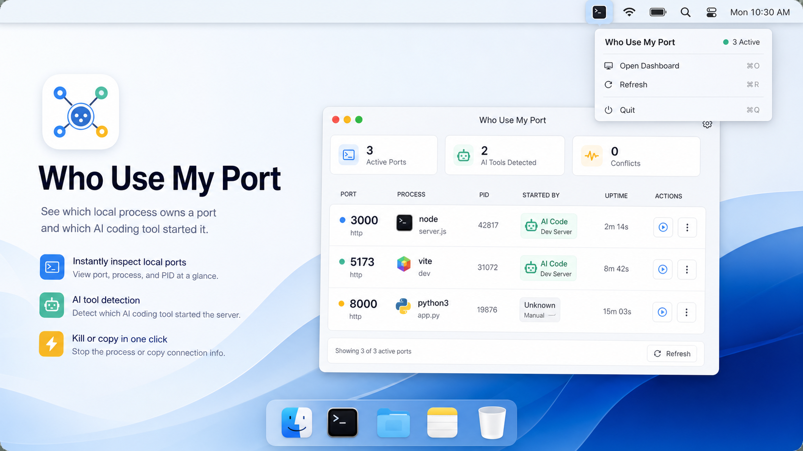

# Who Use My Port



Who Use My Port is a macOS utility for finding which local process is using a port, inspecting process details, and cleaning up stale development-server ownership records.

It is designed for developer machines where local services are frequently started by humans and AI coding tools. The app combines live system port data from macOS with optional `whoport` registrations so you can see not only what is listening, but also which tool/project claimed the port.

The top-right macOS entry point is a menu bar item / status bar item. In SwiftUI this is implemented with `MenuBarExtra`; it is not a macOS widget.

## Features

- Scan a single port, a range, or mixed queries such as `3000, 5000-5010`.
- Inspect listener process metadata, users, commands, and connection state.
- Select one or more occupying processes for cleanup actions.
- Track AI-started dev servers through the bundled `whoport` CLI registry.
- Delete stale AI usage registrations without terminating any process.
- Copy useful diagnostic commands and reports.

## Requirements

- macOS 14 or newer.
- Xcode for building from source.
- Python 3 for the optional `whoport` CLI.

## Build The App

Open `WhoUseMyPort.xcodeproj` in Xcode and build the `WhoUseMyPort` scheme.

Command line:

```sh
xcodebuild -project WhoUseMyPort.xcodeproj -scheme WhoUseMyPort -configuration Debug -derivedDataPath DerivedData build
```

## App Usage

Enter a port query such as:

```sh
3000
3000-3010
3000, 5000-5010
```

The app uses macOS system tools (`lsof`, `ps`, and `kill`) and may need elevated permissions outside the app for processes owned by other users.

## whoport CLI

`whoport` is a small local bridge for AI-assisted development tools. It writes port usage registrations to:

```text
~/Library/Application Support/WhoUseMyPort/registry.json
```

Check a port:

```sh
bin/whoport check 3000
```

Run a server while registering ownership:

```sh
bin/whoport wrap 3000 --tool codex --project "$PWD" -- pnpm dev
```

Reserve and release manually:

```sh
bin/whoport reserve 3000 --tool codex --project "$PWD" --command "pnpm dev" --purpose "Next.js dev server"
bin/whoport release 3000 --tool codex --project "$PWD"
```

See [docs/whoport.md](docs/whoport.md) for the full CLI reference.

## AI Agent Hook

The shell hook provides helper functions such as `whoport_check`, `whoport_run`, and `whoport_release`.

```sh
export WHOPORT_TOOL=codex
export WHOPORT_BIN="$PWD/bin/whoport"
. "$PWD/hooks/whoport-hook.sh"
```

Then start local servers through:

```sh
whoport_run 3000 -- pnpm dev
```

See [docs/ai-hook-setup.md](docs/ai-hook-setup.md) for setup details.

## Privacy And Safety

- The app stores local registry data on your machine only.
- No network service is required for scanning or registry tracking.
- Live process data comes from local macOS tools.
- Process termination is an explicit user action.
- Removing a stale `whoport` registration does not terminate a process.

## Contributing

Issues and pull requests are welcome. Keep changes focused, match the existing SwiftUI and shell/Python style, and include verification notes for behavior changes.

## License

MIT
